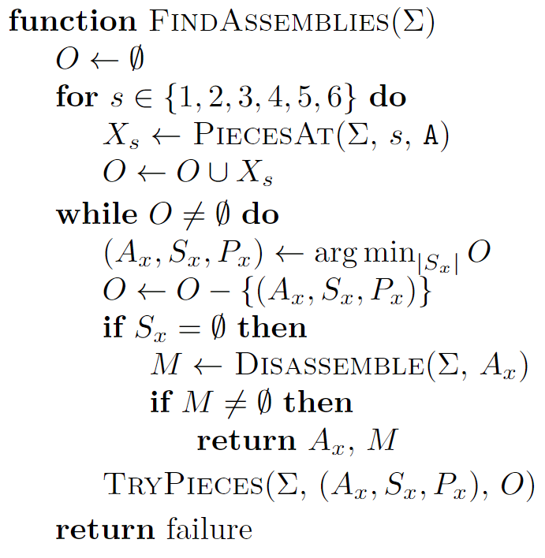

# 4M26 - Burr Puzzle Solver

This repository contains a program for solving
[6-piece burr puzzles](https://en.wikipedia.org/wiki/Burr_puzzle).
We will be studying it in the context of problem solving, focusing on three main
concepts:

1. Representation
2. Process
3. Visualisation

## Getting Started

On posix:

    python -m venv .env
    . .env/bin/activate
    pip install --upgrade pip
    pip install -e .
    burrsolver

On Windows:

    python -m venv .env
    .env\Scripts\activate
    python -m pip install --upgrade pip
    pip install -e .
    burrsolver

The output should be:

    Solving puzzle 0
    Shapes:
    xxxxxx/xx..xx/x....x/x....x
    xxxxxx/xxxxxx/x.x..x/x.x..x
    xxxxxx/xxxxxx/xxxxxx/xxxxxx
    xxxxxx/xxx.xx/x....x/x....x
    xxxxxx/xx..xx/x..xxx/x...xx
    xxxxxx/xx..xx/xxx..x/x....x

    Valid assembly A1a B2f E3a C4h F5g D6h found after checking 1 assembly over 1148 iterations
    Disassembly takes 5 steps:
    0: UP 6 [E3a]
    1: RIGHT 4 [A1a]
    2: FORWARD 4 [C4h D6h]
    3: UP 3 [F5g]
    4: FORWARD 5 [B2f]
    View solution: ./solution0.html

Some sample puzzles are provided in [puzzles.json](./puzzles.json). The pieces
are described using a simple text format: for each row of six voxels in the piece,
an `x` indicates that it is occupied and a `.` indicates it is empty. You can run
other puzzles by providing different puzzle numbers:

    Solving puzzle 3
    Shapes:
    xxxxxx/xxxxxx/xx..xx/xxx..x
    xxxxxx/xxx.xx/xx..xx/x.x..x
    xxxxxx/xx..xx/x....x/xx...x
    xxx.xx/xxxxxx/x.x..x/x....x
    xx..xx/xxxxxx/x....x/x.x..x
    xx.xxx/xxxxxx/x....x/x....x

    Puzzle is level 6 (Higher levels can result in longer solve times)
    Valid assembly A3a B1b E2c D4h C5h F6c found after checking 3 assemblies over 17 iterations
    Disassembly takes 9 steps:
    0: RIGHT 1 [B1b]
    1: UP 1 [E2c]
    2: RIGHT 1 [(2,0,-2,X)1b F6c]
    3: DOWN 1 [A3a C5h D4h]
    4: BACKWARD 1 [(2,2,0,Y)2c (2,2,0,Z)6c (4,0,-2,X)1b]
    5: DOWN 5 [(-2,-2,0,Y)5h (0,-2,2,X)4h (0,-4,0,Z)3a]
    6: LEFT 5 [(2,2,-2,Z)6c]
    7: FORWARD 5 [(2,2,-2,Y)2c]
    8: FORWARD 6 [(4,0,-4,X)1b]
    View solution: ./solution3.html

You can also solve your own puzzles by adding them to the JSON file.

The solution is displayed as a [scenepic](https://microsoft.github.io/scenepic/).
You can see a pre-rendered example from the solve for puzzle 1 below:


[View more solutions here](https://matajoh.github.io/4M26-burrsolver)

## Burr Puzzles

The 6-piece burr puzzle (so called due to resembling a burr, as far as we are aware)
has been known and studied for centuries. One of the earliest depictions is in
Chambers's Cyclopaedia (1689), where it appears in the frontispiece:


Here is a US patent from 1917 for a burr puzzle:


In China, they are known as Lu Ban Locks (鲁班锁) after the inventor Lu Ban. In
Kerala, India, these wooden puzzles are called edakoodam (ഏടാകൂടം).

Each piece is a $2 \times 2 \times 6$ grid of cubes, in which some cubes have been
removed to allow the puzzle to fit together:


In his seminal studies on the topic, William Cutler determined there are 837 usable
pieces. These pieces can be combined to create over 35 billion possible assemblies,
but in practice fewer than 6 billion of them are actual puzzles, capable of being
manufactured and assembled. Still, that is a lot of puzzles! Puzzles are rated for
difficulty based upon how many voids there are in the inner cavity, with a level 1
puzzle having no voids, a level 2 having 1 void, and so on.

## The Problem

I have collected burr puzzles for many years, and love them. During our recent move,
my three-year-old son found my box of burr puzzles and cheerfully disassembled them
all. It looked much like this:


It struck me that it would be a useful thing to build a tool which, provided a set
of pieces, was able to figure out how to assemble and disassemble them into a puzzle.
Thus, our goal is to take these pieces and form them into puzzles:


(Thank you to [Brendan Moran](https://github.com/bremoran) for printing these sample
puzzles!)

## Representation

The first order of business is to answer the following questions:

1. What does the program need to know about the problem?
2. How does a user communicate that to the program?

### Voxel Sets

In order to solve a burr puzzle, the program needs to represent each shape and its
location in space. Anyone who has played Minecraft has probably noticed that each
burr piece consists of 24 voxels. We can use this fact to reduce the shape of each
piece to a set of voxels:


Each voxel is a tuple of 3 numbers indicating the position of the voxel in 3D space.
We can test for collision by looking for intersections between sets:


Here is the shape class:

```python
Orientations = Mapping[str, List[int]]

class Shape(NamedTuple("Shape", [("voxels", Tuple[Voxel, ...]),
                                 ("orientations", Orientations)])):
    def move_to(self, p: Piece) -> "Shape":
        voxels = tuple(v.move_to(p.position, p.orientation)
                       for v in self.voxels)
        return Shape(voxels, self.orientations)

    def inside_count(self) -> int:
        """Return the number of voxels inside the puzzle."""
        return sum(v.is_inside() for v in self.voxels)
```

We will assign a number and colour to each shape, like so:


Furthermore, each shape has 8 possible orientations:


(only some of these are valid at a particular location in the puzzle due to missing
voxels). Since each shape can be at various positions and orientations, we will
define a `Piece` class for storing that information:

```python
class Piece(NamedTuple("Piece", [("shape", int),
                                 ("position", Position),
                                 ("orientation", int)])):
    def is_flipped(self) -> bool:
        return self.orientation > 3

    def move(self, d: Direction, steps: int) -> "Piece":
        return Piece(self.shape,
                     self.position.move(d, steps),
                     self.orientation)
```

Usually, 3D rotation is a complex issue requiring careful maths, however with
careful examination we can see the burr puzzles are axis-locked and pieces do
not change rotation once placed. As such, we can use a constrained form of
rotation which works for our integer voxel locations, as seen below:

```python
def move_to(self, p: Position, n: int) -> "Voxel":
    x, y, z = self
    if n > 3:
        n -= 4
        if n > 3:
            raise ValueError("Invalid orientation")

        x, z = -x, -z       # rotate 180 deg/Y

    match n:
        case 1:
            x, y = -y, x    # rotate 90 deg/Z
        case 2:
            x, y, = -x, -y  # rotate 180 deg/Z
        case 3:
            x, y = y, -x    # rotate 270 deg/Z

    match p.axis:
        case Axis.Z:
            return Voxel(x + p.x, y + p.y, z + p.z)
        case Axis.Y:
            # rotate 90 deg/X
            return Voxel(x + p.x, -z + p.y, y + p.z)
        case Axis.X:
            # rotate 90 deg/Y
            return Voxel(z + p.x, y + p.y, -x + p.z)
        case _:
            raise ValueError("Invalid axis")
```

### Human/Computer Interface

Voxels sets are great, but how does the user communicate the shapes to the program?
We have a two main options:

1. Command Line Interface (CLI)
2. Graphical User Interface (GUI)

They each have pros and cons. A CLI is precise, fairly straightforward to code,
and accessible due to being text-based instead of visual. However, the affordances
are rather limited. GUIs, on the other hand, have the advantage of being expressive
and visual, but are very hard to do well. Ultimately, you need to have a sense of
who your users are. If only a handful of people will ever use your tool and they
are all comfortable with a CLI, then that is usually the way to go.

Indeed, that is what we have here with this tool. Users specify their puzzles via
a JSON file that is passed to a CLI. Each piece is encoded as a simple string as
describe above, where `x` denotes an occupied voxel and `.` indicates a void. The
puzzle shown above is encoded as:

    xxxxxx/xxxxxx/xx..xx/xxx..x
    xxxxxx/xxx.xx/xx..xx/x.x..x
    xxxxxx/xx..xx/x....x/xx...x
    xxx.xx/xxxxxx/x.x..x/x....x
    xx..xx/xxxxxx/x....x/x.x..x
    xx.xxx/xxxxxx/x....x/x....x

## Process

Our focus at this stage is on three questions:

1. What is the problem?
2. How does the program solve that problem?
3. What does a solution look like?

As we determined above, the problem at hand is to assemble a set of burr pieces
into a completed puzzle. A solution will show a user how to assemble the pieces
into the puzzle. That just leaves the core question: how do we solve the puzzle?
There are essentially two subproblems we need to solve:

1. Find an assembly
2. Check if it can be disassembled

In the case of level 1 puzzles, there is only 1 valid assembly, and it can always
be disassembled. For a level 9 puzzle, which has 8 voids in the middle cavity,
there are thousands of valid assemblies of which only a few (perhaps only 1!) can
be disassembled. In both cases, we are looking for a needle in a haystack. Just
how big is that haystack?

### Finding an assembly

Naively, there are 6 pieces, each of those 6 pieces can be in one of twelve
locations in one of 8 orientations. Each placement reduces the number of possible
positions a bit, so that you get something like:

1. $6 \times 12 \times 8 = 576$
2. $5 \times 10 \times 8 = 400$
3. $4 \times 8 \times 8 = 256$
4. $3 \times 6 \times 8 = 144$
5. $2 \times 4 \times 8 = 64$
6. $1 \times 2 \times 8 = 16$

Leading to a grand total of about 8 trillion possible assemblies we need to check!
However, in practice there are far fewer possibilities.

First, we can reduce the entire thing by a factor of 12 by exploiting symmetry.
Each starting location is symmetric with all other starting locations, as we can
see below:


Furthermore, our calculations above were wrong in two ways. First: once a
starting position has been chosen, it reduces the number of remaining positions
to 5, not 10. Furthermore, each piece has only two valid orientations on average
(one a flipped version of the other). Some rare pieces have 4, but if we save
those for last then we can reliably model the scaling as there being only 2
orientations. Finally, if we incrementally assemble pieces checking for collisions,
then we will not need to visit a large number of possible states. This means,
ultimately, that in practice the scaling can be modeled as:

1. $6$
2. $5 \times 5 \times 2 = 50$
3. $4 \times 4 \times 2 = 32$
4. $3 \times 3 \times 2 = 18$
5. $2 \times 2 \times 2 = 8$
6. $1 \times 1 \times 2 = 2$

Leading to a much more managable $2,764,800$ possible assemblies to check, of
which we will only visit a fraction. Here is the algorithm for finding assemblies:



$\Sigma$ here denotes the shape information for the puzzle, including valid
orientations for shapes.


This is a form of Breadth-First Search, in which we examine several potential
starting pieces, preferring assemblies which are closer to finished. Note that
we will potentially need to examine a large number of assemblies before we find
a valid one (in the case of higher level puzzles). Here is the algorithm
implemented in Python:

```python
class AssemblyState(NamedTuple("AssemblyState",
                               [("puzzle", PuzzleState),
                                ("shapes", FrozenSet[int]),
                                ("places", FrozenSet[str])])):
    def add(self, place: str, piece: Piece) -> "AssemblyState":
        return AssemblyState(self.puzzle.add(piece),
                             self.shapes - set([piece.shape]),
                             self.places - set([place]))

    @property
    def num_remaining(self):
        return len(self.places)

    def remaining(self):
        for shape in self.shapes:
            for place in self.places:
                yield shape, place


def try_pieces(puzzle: Puzzle,
               state: AssemblyState,
               frontier: List[AssemblyState]):
    voxels = frozenset(sum([puzzle.voxels_for(p)
                            for p in state.puzzle.pieces], tuple()))
    for shape, place in state.remaining():
        for piece in puzzle.pieces_at(shape, place):
            if voxels.isdisjoint(puzzle.voxels_for(piece)):
                new_state = state.add(place, piece)
                heapq.heappush(frontier, (new_state.num_remaining,
                                          new_state))


def solve(puzzle: Puzzle) -> Solution:
    order = puzzle.order_by_orientations()
    shapes = frozenset(puzzle.order_by_orientations())
    places = frozenset(["A", "B", "C", "D", "E", "F"])
    start = AssemblyState(PuzzleState(()), shapes, places)
    frontier: List[Tuple[int, AssemblyState]] = []

    for s in order:
        if len(puzzle.shapes[s].orientations["A"]) > 2:
            continue

        state = start.add("A", puzzle.pieces_at(s, "A")[0])
        heapq.heappush(frontier, (state.num_remaining, state))

    num_checked = 0
    num_iterations = 0
    while frontier:
        num_iterations += 1
        _, state = heapq.heappop(frontier)
        if state.num_remaining == 0:
            num_checked += 1
            puzzle = puzzle.to_state(state.puzzle)
            moves = disassemble(puzzle)
            if moves:
                return Solution(moves[0][0], moves, num_iterations, num_checked)

            continue

        try_pieces(puzzle, state, frontier)

    raise ValueError("No valid assembly found")
```

Once we have an assembly, we have to check to see if we can disassemble it. For
this we will turn to A* search again, though in a much more complex domain than
we have seen in the past. A* will operate over the state of the puzzle itself.
The edges in the graph will be valid moves which change the state of the pieces.
We will be done when there are no pieces left to take away. Here is what that
looks like in Python:

```python
def disassemble(puzzle: Puzzle) -> List[Tuple[PuzzleState, Move]]:
    start = puzzle.state()

    def distance(a: PuzzleState, b: PuzzleState) -> int:
        return 1

    def heuristic(a: PuzzleState) -> int:
        return len(a.pieces)

    def neighbors(a: PuzzleState):
        puzzle_a = puzzle.to_state(a)
        for move in puzzle_a.valid_moves():
            yield move, puzzle_a.do_move(move).state()

    def is_goal(a: PuzzleState) -> bool:
        return len(a.pieces) == 0

    return astar(distance, heuristic, neighbors, is_goal, start)
```

In this slightly modified implementation of A*, the algorithm stores both the
node and edge during the search for use in reconstruction of the path, as the
edges (in this case, complex moves) are expensive to recompute. The heavy lifting
here is being done by the valid moves algorithm:


This algorithm uses the voxel sets to test out moving various subsets of pieces
in different directions. Any move will be considered in the search. Here it is
in Python:

```python
def valid_moves(self):
    sizes = [1]
    if len(self.pieces) > 3:
        sizes.append(2)
    if len(self.pieces) == 6:
        sizes.append(3)

    piece_voxels = {p: self.voxels_for(p) for p in self.pieces}
    voxels = frozenset(sum(piece_voxels.values(), tuple()))

    for size in sizes:
        for subset in combinations(self.pieces, size):
            # Find all voxels occupied by the subset
            subset_voxels: Tuple[Voxel, ...] = sum(
                [piece_voxels[p] for p in subset], tuple())

            # Remove them from the set of all voxels
            old_voxels = voxels.difference(subset_voxels)

            for d in Direction:
                # Try moving the subset in the given direction
                can_move = True
                is_outside = False
                steps = 0
                while can_move:
                    any_inside = False
                    for v in subset_voxels:
                        vv = v.move(d, steps + 1)
                        if vv in old_voxels:
                            can_move = False
                            break

                        if not any_inside:
                            any_inside = vv.is_inside()

                    if can_move:
                        steps += 1
                        if not any_inside:
                            is_outside = True
                            break

                if steps:
                    if not is_outside:
                        # If the pieces are still in the puzzle we have
                        # to go by a single step
                        steps = 1

                    yield Move(frozenset(subset), d, steps)
```

Note how in this implementation we optimise the search a bit by trying to remove
each subset from the puzzle at each step. In practice, this speeds up search
considerably by reducing the number of pieces whenever possible.

At this point we have found a valid assembly, and produced a series of moves
that disassemble that assembly. Naturally, if we reverse these moves, we also
have found out how to assemble the puzzle.

## Visualisation

We have a way to communicate the puzzle to the program, and the program has a
way to solve the puzzle. At this final stage, we have two key questions to address:

1. What does the user need to know about the solution?
2. How does the program communicate that to the user?

The user needs to know what moves to make to disassemble and reassemble the puzzle,
so our focus should be on communicating that information clearly and unambiguously.
Again, we have two options: a CLI and a GUI. These can both be useful. A text
representation of the solution can be constructed in such a way that it is precise,
and thus can be used for correctness testing. Take this solution for example:

    Puzzle is level 6 (Higher levels can result in longer solve times)
    Valid assembly A3a B1b E2c D4h C5h F6c found after checking 3 assemblies over 17 iterations
    Disassembly takes 9 steps:
    0: RIGHT 1 [B1b]
    1: UP 1 [E2c]
    2: RIGHT 1 [(2,0,-2,X)1b F6c]
    3: DOWN 1 [A3a C5h D4h]
    4: BACKWARD 1 [(2,2,0,Y)2c (2,2,0,Z)6c (4,0,-2,X)1b]
    5: DOWN 5 [(-2,-2,0,Y)5h (0,-2,2,X)4h (0,-4,0,Z)3a]
    6: LEFT 5 [(2,2,-2,Z)6c]
    7: FORWARD 5 [(2,2,-2,Y)2c]
    8: FORWARD 6 [(4,0,-4,X)1b]

A few useful things are communicated to the user here. First, they are informed
of the difficulty of the puzzle and given a sense of how efficient the search
has been. In this case, the algorithm has done extremely well. We provide a
precise text representation of the assembly: `A3a B1b E2c D4h C5h F6c`. We can
decode this in the following way:

1. `A-F`: Position in the puzzle
2. `1-6`: Shape index
3. `a-h`: Orientation

We then use this representation to communicate the moves that must be performed.
While this representation is exact, it is hard to follow for a non-expert (and
for experts as well!). Thus, in this case, there is a strong reason to use a GUI,
and the cost of implementing it is helped by the fact that graphical output is
much easier than graphical input. For example, an animation like the one below
depicts the solution above in a much more intuitive way:


The animations you have seen here have been built using an open source 3D
visualisation toolkit called [ScenePic](https://microsoft.github.io/scenepic),
but there are many other options. You can view interactive visualisations of
various solutions at the following page: https://matajoh.github.io/4M26-burrsolver.
For sample code showing how to construct these visualisations,
see [this code file](src/burrsolver/visualization.py).